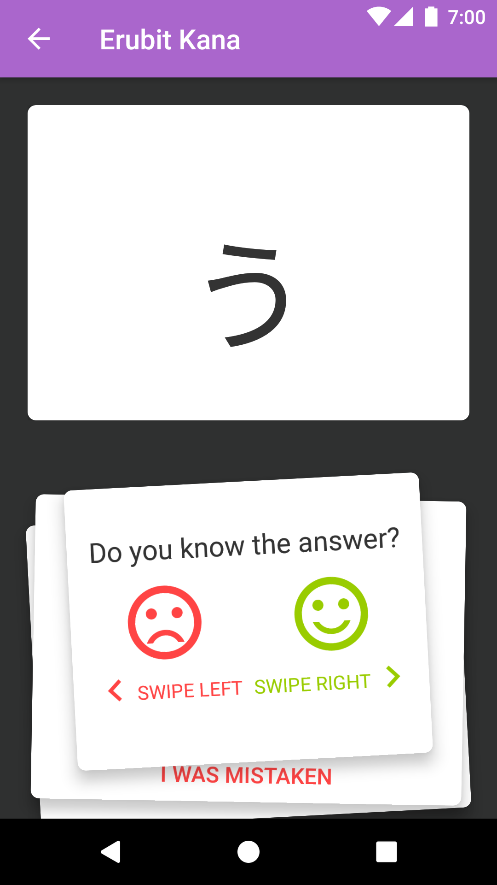
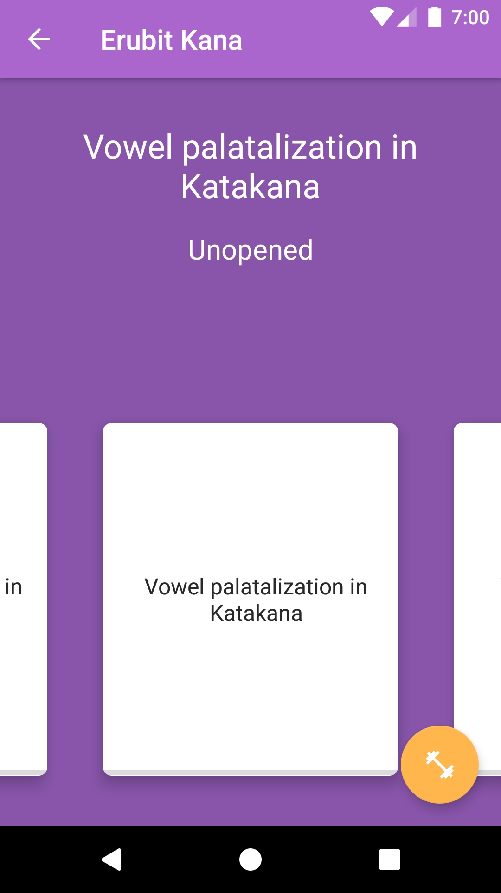
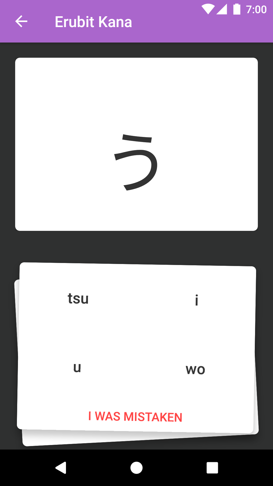
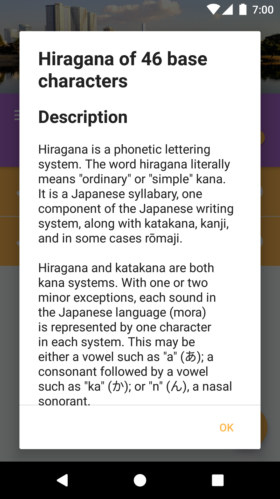
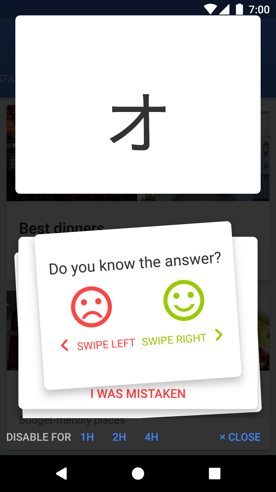

## Erubit Kana courses
Educational courses for
[Erubit Kana Android application](https://play.google.com/store/apps/details?id=com.erubit.kana).

Any contributions and translations are highly welcome.

### Description
Please take a look at the educational app at Google Play
[https://play.google.com/store/apps/details?id=com.erubit.kana](https://play.google.com/store/apps/details?id=com.erubit.kana).

#### Screenshots


#### Details
##### Entry point
Entry point, containing list of courses is a `__contents.json` file
```json
[
  { "active": true,  "name": "hiragana" },
  { "active": true,  "name": "katakana" },
  { "active": false, "name": "advakana" }
]
```
* `"active": true|false` is an initial state of course, user will define courses to learn by himself
after first launch.
* `"name"` is file containing course lessons

##### Course
```json
{
  "id": "<string id>",
  "title": "@ref ref_hiragana_title",
  "description": "@ref ref_hiragana_description",
  "lessons": [
    "hiragana_welcome",
    "hiragana_a",
    "hiragana_ka"
  ]
}
```
* `"id"` any string
* `"title"` and `"description"` fields might be either a normal text or a reference.
References are used for [multilingual support][#multilingual].

##### Lesson
```json
{
  "id": "36eb7c0",
  "title": "@ref ref_hiragana_a_title",
  "type": "Set",
  "set": [
    { "i": 0, "c": "あ", "m": "a" },
    { "i": 1, "c": "い", "m": "i" },
    { "i": 2, "c": "う", "m": "u" },
    { "i": 3, "c": "え", "m": "e" },
    { "i": 4, "c": "お", "m": "o" }
  ],
  "variants": [
    "a",   "i",   "u",   "e",  "o"
  ]
}
```
* `"type"` should be `"Set"`
* `"set"` is a list of characters to learn
* `"variants"` is a list of possible wrong answers

##### <a name="multilingual"></a>Multilingual support
Text fields, like titles might be translatable for many languages.

`"title": "Hiragana"`

**or**

`"title": "@ref ref_hiragana_title"`

and in this case

* `courses/ref_hiragana_title` contents:
```
Hiragana
```
* `courses-ru/ref_hiragana_title` contents:
```
Хирагана
```
